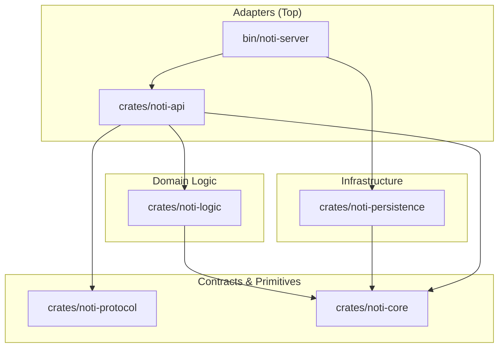

# ARCHITECTURE — gridtokenx-noti-service

This service is structured as a **Modular Monolith** Cargo workspace. It follows the **"Sync Core, Async Edges"** principle and enforces strict acyclic layering.

---

## 🏗️ Layered Architecture

All dependencies flow downwards. Higher layers must never be imported by lower layers.

### 📦 Crate Inventory

| Crate / Directory | Layer | Responsibility |
|:---|:---|:---|
| **[noti-server](file:///bin/noti-server)** | Adapter | Binary entry point, environment loading, logging initialization, telemetry setup, and wiring the application via dependency injection. Hosts Kafka and RabbitMQ background consumer threads. |
| **[noti-api](file:///crates/noti-api)** | Adapter | ConnectRPC (gRPC) and REST (Axum) endpoints. Implements JWT validation and hosts the active WebSocket connection registry. Maps inbound web/RPC events to domain orchestrator calls. |
| **[noti-logic](file:///crates/noti-logic)** | Domain | Core business rules (orchestrator execution flow, mapping channels to providers, retry configuration, rendering template variables). |
| **[noti-persistence](file:///crates/noti-persistence)** | Infrastructure | Adapters for data layers: PostgreSQL repository (SQLx), Redis caching client, RabbitMQ message publisher, Kafka setup, SMTP/lettre, and mock providers. |
| **[noti-protocol](file:///crates/noti-protocol)** | Contract | Wire contracts and serialization code compiled from Protobuf files. |
| **[noti-core](file:///crates/noti-core)** | Primitives | Domain model structs (`Notification`, `NotificationChannel`, `NotificationStatus`), dependency injection traits (contracts), configuration schemas, and clean custom errors. |

---

## 🛠️ Key Design Decisions

### 1. Trait-Based Dependency Injection (DI)
The `noti-logic` layer (Domain) must remain pure and independent of database-specific logic or message broker dependencies. 
- All external dependencies are defined as interfaces (Traits) in `noti-core` (e.g. `NotificationRepositoryTrait`, `CacheTrait`, `MessageQueueTrait`, `NotificationProviderTrait`).
- Concrete implementations are written in `noti-persistence` (SQLx Postgres, Redis, RabbitMQ, lettre).
- At startup, the `noti-server` instantiates the infrastructure objects, wraps them in `Arc`, and injects them into the `NotificationOrchestrator` as trait objects (`Arc<dyn Trait>`).

### 2. Decoupled WebSocket Architecture
To push notifications in real-time without introducing circular dependencies between layers:
- The WebSocket Axum route and `ConnectionManager` (which keeps track of active user channels in a thread-safe `DashMap`) live in `crates/noti-api`.
- The `ConnectionManager` implements `WebSocketRegistryTrait` (defined in `crates/noti-core`).
- In `crates/noti-persistence`, the `WebSocketProvider` implements `NotificationProviderTrait` but only holds a reference to `Arc<dyn WebSocketRegistryTrait>`.
- When the orchestrator dispatches a `WebSocket` notification, the persistence provider maps the recipient to a user ID and forwards the payload to the registry, decoupling API networking from infrastructure storage.

### 3. Sync Core, Async Edges
The core business domain (rendering variables, resolving template names, mapping errors) is executed synchronously. The asynchronous outer edges (fetching/saving to database, publishing to queues, calling external email gateways, reading Kafka/RabbitMQ events) are triggered at the adapters boundaries. This keeps domain business logic easy to mock and isolate.

### 4. HTTP/3 & QUIC Support
The server handles gRPC (over TCP/HTTP2) and HTTP/3 (over UDP/QUIC) concurrently on the gRPC port (`PORT + 10`).
- The startup sequence initiates a UDP socket via `quinn` and configures `rustls` using standard ALPN protocols (`h3`).
- Inbound QUIC connections are processed using `h3` and handed over to the Axum router using `h3-axum`, enabling low-latency, multiplexed streaming to modern clients while co-existing on the same port as gRPC.

### 5. Modern Module Layout
The project fully adheres to modern Rust module organization:
- Avoids legacy `mod.rs` files.
- Uses `lib.rs` alongside folder-name file declarations (e.g., `providers.rs` alongside directory `providers/` containing individual files `smtp.rs` and `websocket.rs`).
- Improves file discoverability and navigation in editors.

### 6. Hybrid Error Strategy
- Domain errors (`crates/noti-core/src/error.rs`) define specific, typed failures (`NotiError`) using `thiserror`.
- Application boundaries (`noti-api`, `noti-server`) use `anyhow` to attach context to failure paths before logging or responding to client requests.
- All DI traits enforce `Result<T, NotiError>` to maintain structured errors at the core boundary.
