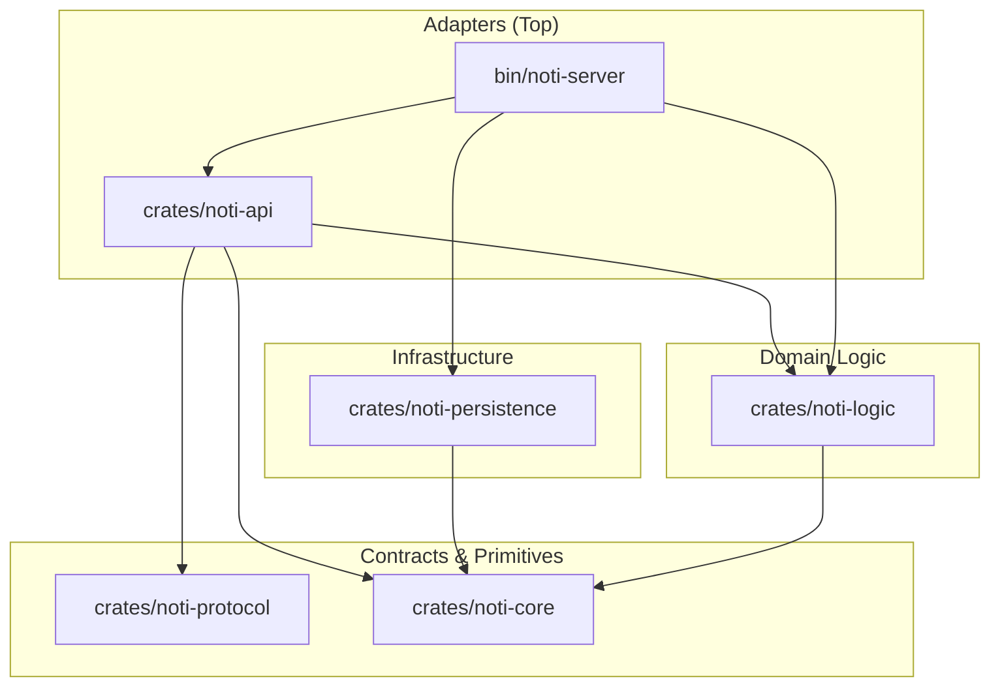

# ARCHITECTURE — gridtokenx-noti-service

This service is structured as a **Modular Monolith** Cargo workspace (Edition 2024) with 6 crates.
It follows **hexagonal (ports-and-adapters)** architecture with the **"Sync Core, Async Edges"** principle
and enforces strict acyclic layering.

---

## 🏗️ Layered Architecture

All dependencies flow downwards. Higher layers must never be imported by lower layers.



### Dependency Graph

```
noti-core           (leaf — no internal deps)
noti-protocol       (leaf — generated from proto)
noti-logic       →  noti-core
noti-persistence →  noti-core
noti-api        →  noti-core, noti-protocol, noti-logic, gridtokenx-blockchain-core
noti-server     →  noti-core, noti-protocol, noti-persistence, noti-logic, noti-api
```

### 📦 Crate Inventory

| Crate / Directory | Layer | Responsibility |
|:---|:---|:---|
| **bin/noti-server** | Adapter | Binary entry point. Loads `.env`, initializes telemetry, parses `Config`, wires all dependencies as trait objects in `startup::run()`. Hosts Kafka and RabbitMQ background consumer threads. |
| **crates/noti-api** | Adapter | ConnectRPC (gRPC) and REST (Axum) endpoints. JWT validation, WebSocket connection registry (`DashMap`-based `ConnectionManager`). Maps inbound web/RPC events to orchestrator calls. |
| **crates/noti-logic** | Domain | `NotificationOrchestrator` — synchronous business logic for queue/dispatch/retry, channel→provider mapping. Only depends on `noti-core` traits. |
| **crates/noti-persistence** | Infrastructure | Concrete adapters: SQLx Postgres repository (dual-pool), Redis cache, RabbitMQ publisher, Kafka consumer factory, SMTP (lettre), Tera template engine, WebSocket bridge provider, mock providers. |
| **crates/noti-protocol** | Contract | Wire contracts generated from `proto/noti.proto` via `buffa-build` + `connectrpc-build`. |
| **crates/noti-core** | Primitives | Domain models (`Notification`, `NotificationChannel`, `NotificationStatus`), 6 DI trait contracts, `Config` struct, `NotiError` (thiserror). Zero I/O. |

---

## 🔁 Notification Flow

```
                          ┌─────────────┐
   Kafka Events ──────►   │ consumers.rs │ ──► orchestrator.queue_notification()
  (iam.user.events,       │ (noti-server)│        │
   iam.audit.events)      └─────────────┘        ├── 1. Idempotency check (Redis)
                                                      ├── 2. Persist (Postgres)
                                                      ├── 3. Cache key (Redis, TTL 3600s)
                                                      └── 4. Publish dispatch task (RabbitMQ)
                                                              or fallback spawn
                                                                  │
                          ┌─────────────┐                         ▼
   RabbitMQ ──────────►   │ consumers.rs │ ──► orchestrator.dispatch(id)
   (noti.dispatch)        │ (noti-server)│        │
                          └─────────────┘        ├── 1. Mark Processing
                                                  ├── 2. Render template (Tera)
                                                  ├── 3. Select provider by channel
                                                  └── 4. Send via provider
                                                          │
                                                   ┌──────┴──────┐
                                                   │ Success     │ Failure
                                                   ▼             ▼
                                              Mark Sent     retry_count < 5?
                                                + sent_at      ├── Yes: exp backoff
                                                               │   delay = 2^n × 60s
                                                               │   requeue to RabbitMQ
                                                               └── No: PermanentFailure
```

### Event Type → Template Mapping

| Event Type | Channel | Template | Variables |
|:---|:---|:---|:---|
| `UserRegistered` | — | *(none)* | Explicit no-op (`consumers/events.rs:385`): the welcome mail waits for `EmailVerified`, so an unverified address is never mailed twice. |
| `EmailVerified` | Email | `welcome.html.tera` | `name`, `dashboard_url` |
| `VppDispatched` | WebSocket | `vpp_dispatched.txt.tera` | `cluster_id`, `target_kw`, `members_count` (recipient: `admin_user_id` ?? `user_id`) |
| `OrderMatched` | WebSocket **+ Push** | `trade_matched.txt.tera` (+ `push_notification.txt.tera`) | `role`, `amount`, `price` |
| `SettlementProcessed` | WebSocket **+ Push** | `settlement_processed.txt.tera` (+ `push_notification.txt.tera`) | `role`, `status`, `tx_signature`, `amount`, `price` (per party with a UUID) |
| `PriceAlertTriggered` | WebSocket **+ Push** | `price_alert_triggered.txt.tera` (+ `push_notification.txt.tera`) | `condition`, `target_price`, `triggered_price` |
| `ErcIssued` | Email | `erc_issued.html.tera` | `amount`, `unit` (from payload `energy_unit`/`unit`; defaults to `MWh`) |
| `PasswordResetRequested` | Email | `password_reset.html.tera` | `reset_url` |
| `VerificationEmailRequested` | Email | `verify_email.html.tera` | `name`, `verification_url` |
| `UserOnboarded` | WebSocket | `user_onboarded.txt.tera` | `user_account_pda`, `transaction_signature` |
| `MeterOnboarded` | WebSocket | `meter_onboarded.txt.tera` | `meter_id`, `meter_type`, `transaction_signature` |
| `UserWalletLinked` | WebSocket **+ Push** | `security_alert.txt.tera` (+ `push_notification.txt.tera`) | `headline`, `summary`, `wallet_address`, `shard_id`, `transaction_signature` |
| `UserWalletUnlinked` | WebSocket **+ Push** | `security_alert.txt.tera` (+ `push_notification.txt.tera`) | `headline`, `summary`, `wallet_address` (on-chain rows empty) |
| `UserWalletPrimaryChanged` | WebSocket **+ Push** | `security_alert.txt.tera` (+ `push_notification.txt.tera`) | `headline`, `summary`, `wallet_address` (on-chain rows empty) |
| `AccountLocked` | Email | `account_locked.html.tera` | `identifier`, `lockout_minutes` |
| `UserLoggedIn` | WebSocket **+ Push** (new IP only) | `new_login.txt.tera` (+ `push_notification.txt.tera`) | `username`, `ip_address` |
| `OrderCreated` | WebSocket | `order_created.txt.tera` | `order_id`, `order_type`, `side`, `energy_amount`, `price_per_kwh`, `status` |
| `OrderUpdate` | WebSocket (**+ Push** on terminal states) | `order_update.txt.tera` (+ `push_notification.txt.tera`) | `order_id`, `filled_amount`, `status` |
| `MeterRegistered` / `MeterUpdated` | WebSocket | `meter_registered.txt.tera` | `serial_number`, `meter_id`, `zone_id`, `status` |
| `WalletLinkRequested` | Email | `confirm_wallet.html.tera` | `name`, `wallet_address`, `confirmation_url` |

> **`security_alert.txt.tera` is shared** by the three wallet events: the handler supplies `headline` + `summary`, and passes empty `shard_id` / `transaction_signature` for off-chain changes so those rows are omitted.
>
> **`AccountLocked` has no `user_id`** — IAM raises it on the login *identifier* (email or username, `iam-logic/src/auth_service.rs`). With no shared users table, a username cannot be resolved to a mailbox, so the handler emails only when the identifier is an address and never pushes.
>
> **`UserLoggedIn` fires on every sign-in**, so the handler alerts only on a *new* IP: `NotificationOrchestrator::bump_counter` (`noti-logic/src/orchestrator/counters.rs`) increments `login_ip:{user_id}:{ip}` with a 90-day TTL and a return of `1` means first sighting. IAM sends no device fingerprint, so IP is the only novelty signal available. The lookup **fails closed** — a cache outage makes every login look new, and alerting then would storm every user.
>
> **`MeterRegistered` arrives on a fourth topic.** Meter-service publishes to `meter_events` (`METER_EVENTS_TOPIC`), not the IAM topics, so the consumer subscribes to `kafka_topic_meter_events` alongside the other three (`bin/noti-server/src/startup.rs`). `MeterUpdated` is wire-identical and shares the handler; meter-service defines it but has no update path emitting it yet.
>
> **`OrderUpdate` pushes only on terminal states.** A partially-filled order can tick several times per matching cycle, so `partially_filled` stays WebSocket-only; `filled` / `cancelled` / `expired` also push. Its `user_id` is `Option` upstream (`gridtokenx-trading-service/crates/trading-core/src/events.rs`) — the handler skips when it is absent, since this service owns no orders table to resolve an owner.
>
> **`WalletLinkRequested` has no producer yet** — the event name is defined by this service's handler (pre-link ownership confirmation); IAM must emit it and the frontend must serve `/wallet/confirm` before the flow is live.

> **Push channel:** the `WebSocket + Push` events also fan an FCM push out to the user's registered devices. The Push recipient is the `user_id`; `push_notification.txt.tera` renders a `{title, body}` JSON envelope (built in the handler) that `FcmProvider` parses. Independent idempotency keys (`…:push:…`) keep the two channels decoupled under redelivery.

### Delivery Targets (email · web · mobile)

The channel enum is transport; what a product decision actually picks is the
**surface** a user sees it on. Three are live, and they are not alternatives —
the security- and money-relevant events deliberately land on two at once.

| Target | Channel | Events | Rule |
|:---|:---|:---|:---|
| 📧 **Email** | `Email` (SMTP / lettre) | `EmailVerified`, `VerificationEmailRequested`, `PasswordResetRequested`, `WalletLinkRequested`, `ErcIssued`, `AccountLocked` | Account lifecycle and anything carrying a **callback link**. No trading event is emailed — a fill is stale by the time an inbox is checked. |
| 🌐 **Web (in-app)** | `WebSocket` (`/ws`) | `OrderCreated`, `OrderUpdate`, `OrderMatched`, `SettlementProcessed`, `PriceAlertTriggered`, `VppDispatched`, `UserOnboarded`, `MeterRegistered`/`MeterUpdated`, `MeterOnboarded`, `UserWalletLinked`/`Unlinked`/`PrimaryChanged`, `UserLoggedIn` | Everything with a resolvable `user_id`. Best-effort: a disconnected user's frame is dropped, not retried — the REST list is the durable read. |
| 📱 **Mobile** | `Push` (FCM) | `OrderMatched`, `SettlementProcessed`, `PriceAlertTriggered`, `OrderUpdate` (terminal only), `UserWalletLinked`/`Unlinked`/`PrimaryChanged`, `UserLoggedIn` | A strict subset of the web set: only what is worth a buzz **off-session** — money moved, a price target hit, or a security-relevant account change. |

Boundaries worth knowing before adding an event:

- **Web + mobile is the pattern, not a choice between them.** The 8 push events queue *both* a WebSocket and a Push notification with independent idempotency keys (`…:ws` / `…:push`) — WS for an open session, FCM for a closed one. Both rows persist, so both appear in the notification list.
- **"Push" is not mobile-only.** `DevicePlatform` is `android | ios | web` (`crates/noti-core/src/domain.rs:32`), so a browser FCM token receives the same pushes. Nothing registers one from the trading web app today, which is why the mobile target is effectively phone-only in practice.
- **Email is the fallback for events with no user id.** `AccountLocked` arrives keyed on a login identifier, so it can only ever be email — and only when that identifier is an address.
- **`Sms` and `Webhook` are wired but unrouted.** Both have provider slots and a channel variant; no event maps to them. Treat them as capacity, not as targets.

### URL Rewriting

Email callback URLs (`verification_url`, `reset_url`) from upstream Kafka events often contain internal addresses (e.g. `http://localhost:4001/...`). When `FRONTEND_URL` is configured, `consumers.rs` rewrites the scheme+host+port while preserving the path and query string:

```
http://localhost:4001/verify?token=abc  →  https://trading-ui.example.com/verify?token=abc
```

If the upstream event provides only a `token` (no URL), the service constructs the full URL from `FRONTEND_URL` + path + query.

---

## 🛠️ Key Design Decisions

### 1. Trait-Based Dependency Injection (DI)

The `noti-logic` layer must remain pure — no database drivers, no message brokers.

- **6 traits** defined in `noti-core/traits.rs`:

| Trait | Methods | Purpose |
|:---|:---|:---|
| `NotificationRepositoryTrait` | 10 methods | CRUD, idempotency, retry, read-status |
| `NotificationProviderTrait` | 2 methods | `send(recipient, content)` → provider ref; `provider_id()` |
| `WebSocketRegistryTrait` | 1 method | `send_to_user(user_id, message)` |
| `CacheTrait` | 6 methods | KV store + distributed lock (`SET NX EX`) |
| `TemplateEngineTrait` | 1 method (sync) | `render(template_id, variables)` |
| `MessageQueueTrait` | 2 methods | `publish_dispatch`, `publish_retry` |

- Concrete implementations live in `noti-persistence`.
- `noti-server/startup.rs` wraps them in `Arc<dyn Trait>` and injects into `NotificationOrchestrator`.

### 2. Decoupled WebSocket Architecture

To push notifications in real-time without circular dependencies:

- `ConnectionManager` (in `noti-api/websocket.rs`) tracks active user connections via `DashMap<Uuid, mpsc::Sender<String>>` and implements `WebSocketRegistryTrait`.
- `WebSocketProvider` (in `noti-persistence/providers/websocket.rs`) implements `NotificationProviderTrait` but only holds `Arc<dyn WebSocketRegistryTrait>` — it never imports `noti-api`.
- At dispatch time, the orchestrator calls `WebSocketProvider::send()`, which forwards to the registry. No `noti-api` → `noti-persistence` circular dependency.

```
noti-core (WebSocketRegistryTrait)
    ↑ implements              ↑ depends on
noti-api (ConnectionManager)  noti-persistence (WebSocketProvider)
```

#### Client wire shape (`noti_core::wire::NotificationView`)

A stored `Notification` names a template and its variables — it has no title,
no body, and no event name, which is everything a UI needs. `NotificationView`
is the projection that adds them, and **both client transports emit it**, so a
browser parses one shape regardless of how the notification arrived:

- the WebSocket frame (`crates/noti-logic/src/orchestrator/dispatch.rs:59`, WebSocket channel only — every other channel keeps its rendered body verbatim, since an email body *is* the email),
- each row of `GET /api/v1/noti` (`crates/noti-logic/src/orchestrator/query.rs:45`).

```jsonc
{
  // …all stored Notification fields (channel, status, template_id, variables, …)
  "type": "OrderMatched",      // canonical event name, what clients branch on
  "title": "Trade Matched",
  "message": "You have a new trade match.\n\nRole: buyer",
  "is_read": false
}
```

- `type` is the **upstream event**, not the template: `trade_matched` renders an `OrderMatched`, and `SecurityAlert` covers all three wallet events (`variables.headline` distinguishes them). Mapping in `noti_core::wire::event_type`.
- `title`/`message` come from explicit `title`/`headline`/`body` variables first (the push template renders FCM's `{title, body}` JSON, which must never reach a list row), then the `heading` + `-----` underline convention, then the humanized template stem.
- The REST list renders each row through its **text** template (`wire::text_template_id`), so an email row lists as prose instead of a full HTML document. `bin/noti-server/tests/template_coverage.rs` fails if a routed template has no listable `.txt.tera` body.

### 3. Sync Core, Async Edges

- **`TemplateEngineTrait::render()`** is the only sync trait — pure string transformation via Tera.
- **`NotificationOrchestrator`** methods are async (they call async trait methods), but all business decisions (idempotency check logic, provider selection, retry backoff calculation, status transitions) are synchronous branching.
- All async I/O (Postgres queries, Redis commands, SMTP sends, MQ publishes) happens inside trait implementations in `noti-persistence`.

### 4. Dual PostgreSQL Pool

`NotificationRepository` uses two `PgPool` instances for query routing:

| Pool | Used for |
|:---|:---|
| **High-priority** | Writes: `create`, `update_status`, `increment_retry`, `mark_as_read`, `mark_all_as_read`, `get_by_idempotency_key`, `get_pending_for_retry` |
| **Low-priority** (half max connections) | Reads: `get_by_id`, `list_by_user`, `get_unread_count` |

### 5. RabbitMQ Retry Architecture

```
                    ┌──────────────┐
  orchestrator ───► │ noti.exchange │ (Direct)
                    └──────┬───────┘
                           │
                    ┌──────▼───────┐
                    │ noti.dispatch │ ──► consumer ACKs/NACKs
                    └──────┬───────┘
                           │ (on failure)
                    ┌──────▼───────┐
                    │  noti.retry   │ (DLX → noti.exchange)
                    └──────────────┘
```

- `noti.retry` queue has `x-dead-letter-exchange` pointing back to `noti.exchange` with routing key `noti.dispatch`.
- Retried messages include `expiration` header (TTL in ms) for delay.
- Exponential backoff: `delay = 2^retry_count × 60s`, max 5 retries, then `PermanentFailure`.

### 6. SMTP with HTML Auto-Detection

`SmtpProvider::send()` inspects the rendered content:

- **Starts with `<!DOCTYPE` or `<html`** → sends as `multipart/alternative` with both `text/plain` (stripped HTML) and `text/html` parts.
- **Otherwise** → sends as plain `text/plain`.

Three TLS modes: `starttls` (default), `tls` (implicit, port 465), `none` (for local Mailpit testing).

### 7. Hybrid Error Strategy

| Layer | Error Type | Strategy |
|:---|:---|:---|
| `noti-core` | `NotiError` (thiserror, 7 variants) | Typed errors at domain boundaries: `Database`, `Template`, `Provider`, `Validation`, `NotFound`, `Idempotent`, `Internal` |
| `noti-logic` | `Result<T, NotiError>` | Propagates core errors |
| `noti-api` / `noti-server` | `anyhow::Result` | Attaches context (`.context()`) before logging or responding |

All DI traits return `noti_core::Result<T>` (= `std::result::Result<T, NotiError>`).

### 8. Modern Module Layout

- No legacy `mod.rs` files.
- `providers.rs` sits alongside `providers/` directory — acts as both module declaration and mock provider definitions.
- Individual providers in `providers/smtp.rs`, `providers/websocket.rs`.

---

## 🌐 Dual Server

The service runs two HTTP servers concurrently:

| Server | Default Port | Transport | Purpose |
|:---|:---|:---|:---|
| HTTP/REST | `PORT` (8080) | TCP | Axum with health, notification CRUD, WebSocket upgrade, Swagger UI |
| gRPC | `PORT + 10` (8090) | TCP/HTTP2 + UDP/QUIC (HTTP/3) | ConnectRPC service, `quinn` + `h3` for QUIC |

Both servers share the same base Axum router and shut down gracefully via `CancellationToken`. The HTTP router additionally merges Swagger UI (`/swagger-ui`, `/api-docs/openapi.json`) — the docs UI is not served on the gRPC port.

---

## 📡 Proto Contract

`proto/noti.proto` defines a single gRPC service:

```protobuf
service NotificationService {
  rpc SendNotification(SendNotificationRequest) returns (NotificationResponse);
  rpc GetNotificationStatus(GetNotificationStatusRequest) returns (NotificationStatusResponse);
}
```

Enum `Channel`: `EMAIL`, `SMS`, `PUSH`, `WEBHOOK`, `WEBSOCKET`.

Generated via `buffa-build` + `connectrpc-build` in `noti-protocol/build.rs`. Output included in `noti-protocol/src/lib.rs`.

---

## ⚙️ Configuration

Environment-driven (loaded via `dotenvy` + `config` crate). Key variables:

| Variable | Default | Notes |
|:---|:---|:---|
| `PORT` | `8080` | HTTP port; gRPC = PORT + 10 |
| `DATABASE_URL` | required | PostgreSQL |
| `REDIS_URL` | required | Cache, idempotency, distributed locks |
| `KAFKA_BROKERS` | optional | Comma-separated. If empty → no Kafka consumer |
| `RABBITMQ_URL` | optional | Retry/delivery queue. If empty → in-process fallback |
| `JWT_SECRET` | required | WebSocket auth |
| `SMTP_HOST` | optional | If empty → `MockEmailProvider` |
| `SMTP_TLS_MODE` | `starttls` | `starttls`, `tls`, or `none` |
| `FCM_PROJECT_ID` | optional | Firebase project id; real FCM push needs this **and** `FCM_CREDENTIALS_PATH` |
| `FCM_CREDENTIALS_PATH` | optional | Google service-account JSON path (self-mints OAuth2). Both unset → `MockPushProvider` |
| `FRONTEND_URL` | optional | Base URL for email callback links |
| `CERT_FILE` / `KEY_FILE` | `infra/certs/*` | TLS certs for HTTP/3 QUIC |

Supports `RUN_MODE` for environment-specific config files (`config/{RUN_MODE}`) and `APP__`-prefixed env var overrides.

---

## 🧪 Testing

- **Unit tests** in `#[cfg(test)] mod tests` at bottom of files.
- `noti-logic/orchestrator.rs` contains `test_queue_notification` using in-memory mocks (`MockRepo`, `MockCache`, `MockTemplate`, `MockProvider`, `MockMq`).
- Integration tests require infrastructure (Postgres, Redis, Kafka, RabbitMQ).

```bash
cargo test                    # All tests
cargo test -p noti-logic      # Single crate
cargo clippy -- -D warnings   # Lint (workspace lints: deny unsafe, deny unwrap, warn pedantic)
```

---

## 📁 Templates

Tera templates in `templates/`. The `TemplateEngine` loads them at startup via glob (`templates/**/*`) with HTML autoescaping enabled.

| Template | Format | Channel |
|:---|:---|:---|
| `welcome.html.tera` | HTML (green gradient, feature list) | Email |
| `erc_issued.html.tera` | HTML (certificate card) | Email |
| `password_reset.html.tera` | HTML (amber gradient, reset button, warning box) | Email |
| `verify_email.html.tera` | HTML (green gradient, verify button, fallback link) | Email |
| `welcome.txt.tera` | Plain text | Email (fallback) |
| `verify_email.txt.tera` | Plain text | Email (fallback) |
| `password_reset.txt.tera` | Plain text | Email (fallback) |
| `erc_issued.txt.tera` | Plain text | Email (fallback) |
| `trade_matched.txt.tera` | Plain text | WebSocket |
| `push_notification.txt.tera` | JSON `{title, body}` | Push (FCM) — shared by all push events |
| `user_onboarded.txt.tera` | Plain text | WebSocket |
| `meter_onboarded.txt.tera` | Plain text | WebSocket |
| `security_alert.txt.tera` | Plain text | WebSocket |

---

## 🔌 REST API

All routes require `x-gridtokenx-user-id` header (extracted by `UserContext` from `noti-api/auth.rs`).
Authorization is delegated to `gridtokenx-blockchain-core::auth::ServiceRole` (requires `ApiGateway` or `Admin`).

| Method | Path | Handler |
|:---|:---|:---|
| `GET` | `/health` | `health_check` |
| `GET` | `/health/live` | `health_live` |
| `GET` | `/swagger-ui` | Swagger UI (`utoipa-swagger-ui`, HTTP port only) |
| `GET` | `/api-docs/openapi.json` | OpenAPI 3.1 spec (`noti-api::openapi::ApiDoc`) |
| `GET` | `/api/v1/notifications` | `list_notifications` (params: `limit`, `offset`) |
| `PATCH` | `/api/v1/notifications/{id}` | `mark_notification_as_read` |
| `POST` | `/api/v1/notifications/read-all` | `mark_all_notifications_as_read` |
| `GET` | `/api/v1/noti/devices` | `list_devices` (user's active push tokens) |
| `POST` | `/api/v1/noti/devices` | `register_device` (`{token, platform}`) |
| `DELETE` | `/api/v1/noti/devices/{token}` | `revoke_device` |
| `GET` | `/ws?token=<jwt>` | WebSocket upgrade |
