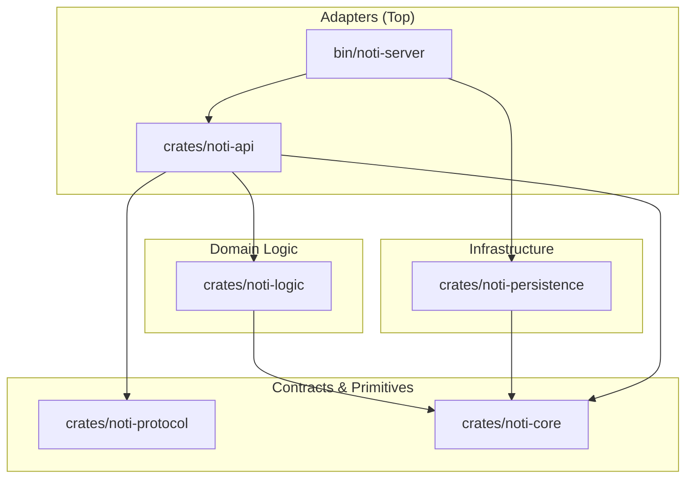

# ARCHITECTURE — gridtokenx-noti-service

This service is structured as a **Modular Monolith** Cargo workspace. It follows the "Sync Core, Async Edges" principle and enforces strict acyclic layering.

## 🏗️ Layered Architecture

All dependencies flow downwards. Higher layers must never be imported by lower layers.

## 📦 Crate Inventory

| Crate | Layer | Responsibility |
|-------|-------|----------------|
| **[noti-server](file:///bin/noti-server)** | Adapter | Entry point, CLI environment, and dependency injection (startup sequence). |
| **[noti-api](file:///crates/noti-api)** | Adapter | ConnectRPC (gRPC) and REST (Axum) handlers. Maps protocols to domain requests. |
| **[noti-logic](file:///crates/noti-logic)** | Domain | Core business rules (orchestration, retries, provider dispatching). |
| **[noti-persistence](file:///crates/noti-persistence)** | Infrastructure | Implementation of storage, message queues, and external delivery providers. |
| **[noti-protocol](file:///crates/noti-protocol)** | Contract | Wire formats and generated code from Protobuf definitions. |
| **[noti-core](file:///crates/noti-core)** | Primitives | Domain entities, pure errors, Trait contracts, and configuration types. |

## 🛠️ Key Design Decisions

### 1. Trait-Based Dependency Injection
The Logic layer does not depend on database or message queue crates directly. It consumes traits defined in `noti-core`, which are implemented by `noti-persistence` and injected at startup.

### 2. Modern Module Structure
The project avoids `mod.rs` files, using the modern `lib.rs` / `module.rs` / `module/` filesystem layout for better editor discoverability.

### 3. Error Handling
We use a hybrid approach: `thiserror` for typed domain errors in `noti-core`, and `anyhow` for opaque error context at the application boundaries (`api`, `server`).

### 4. Dyn Compatibility
All DI traits are designed to be object-safe (dyn-compatible), allowing for runtime flexibility and easy mocking in tests.
