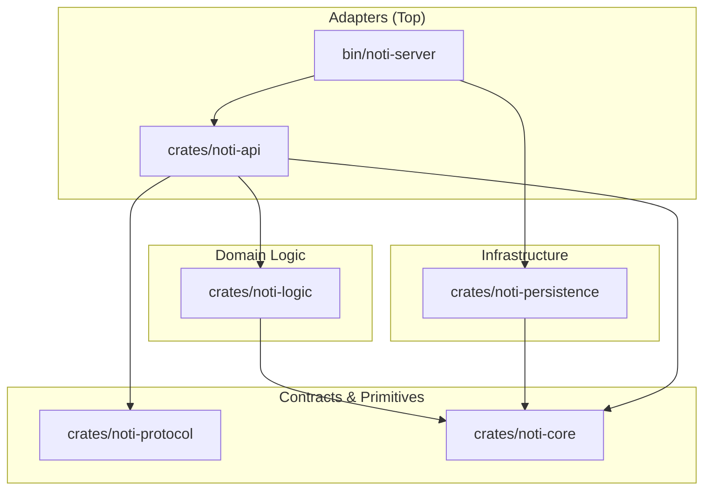

# Notification Service (`gridtokenx-noti-service`)

The **Notification Service** handles all outbound communications for the GridTokenX platform. It functions as a centralized, stateful notification dispatcher supporting multiple delivery channels (Email, WebSockets, SMS, Push notifications, and Webhooks) with built-in templating, rate-limiting, idempotency verification, and robust retry logic.

---

## 🏗️ Architecture

The service is structured as a **Modular Monolith** Cargo workspace following the "Sync Core, Async Edges" design pattern. It enforces strict acyclic layering where dependencies flow downwards.

For a detailed view of the modular setup and design decisions, see the [Architecture Guide](ARCHITECTURE.md).

```
gridtokenx-noti-service/
├── bin/
│   └── noti-server/           # Application entry point & service wiring (startup, telemetry, background consumers)
├── crates/
│   ├── noti-core/             # Core domain models, shared config, DI traits, and custom error types
│   ├── noti-protocol/         # Protobuf definitions and generated ConnectRPC/gRPC wire contracts
│   ├── noti-persistence/      # Database (SQLx/Pg), caching (Redis), message queues (RabbitMQ, Kafka), and providers
│   ├── noti-logic/            # Core business logic (orchestrator execution, retry flow, template resolution)
│   └── noti-api/              # REST, ConnectRPC/gRPC API controllers, and WebSocket handlers
├── migrations/                # SQLx database schema migrations
└── templates/                 # Localized email and WebSocket text/HTML templates (Tera)
```

### Dependency Flow



---

## 🚀 Key Features

* **Multi-Channel Dispatcher:** Native handlers for **Email** (SMTP/Lettre), **WebSockets** (real-time notification pushing), and mocks for **SMS**, **Push**, and **Webhooks**.
* **Template Engine:** Dynamically renders localized email and alert bodies using [Tera](https://tera.netlify.app/) (Jinja2-like templates).
* **Robust Retry Strategy:** Leverages RabbitMQ's Dead-Letter Exchange (DLX) with message TTL to coordinate exponential backoff and retry logic without blocking worker threads.
* **Event-Driven Intake:** Background Kafka consumer listens to key platform events (`UserRegistered`, `OrderMatched`, `ErcIssued`, etc.) to trigger automatic notification alerts.
* **Real-time Push (WebSockets):** Active connection registry maps client sessions to system-driven notifications.
* **HTTP/3 & QUIC Support:** Operates a concurrent HTTP/3 server over UDP alongside standard TCP ConnectRPC on the gRPC port.
* **Idempotency & Caching:** Redis caching for compiled templates, fast idempotency checks (via idempotency keys), and rate-limiting limits.

---

## 🔌 API Reference

### REST Endpoints
The HTTP API serves on `PORT` (default: `8080`):

| Endpoint | Method | Auth | Description |
|:---|:---|:---|:---|
| `/health` | `GET` | None | Service health status |
| `/health/live` | `GET` | None | Service liveness probe |
| `/api/v1/notifications` | `GET` | JWT | List notification history for the authenticated user |
| `/api/v1/notifications/{id}` | `PATCH` | JWT | Mark a specific notification as read |
| `/api/v1/notifications/mark-all-read` | `POST` | JWT | Mark all user notifications as read |
| `/ws` | `GET` | JWT (query param) | Initiate a WebSocket session for real-time notification push |

### gRPC / ConnectRPC Service
Exposed on `PORT + 10` (default: `8090`):

* `SendNotification`: Synchronous request/response endpoint to queue and trigger notifications (primarily for high-priority alerts like OTPs).

---

## ⚙️ Configuration

The service loads settings from environment variables or YAML configuration files located in `config/` via the `config` crate.

| Variable | Default | Purpose |
|:---|:---|:---|
| `PORT` | `8080` | Port for Axum HTTP REST server. gRPC server starts on `PORT + 10` |
| `DATABASE_URL` | *Required* | PostgreSQL connection string |
| `REDIS_URL` | *Required* | Redis connection string (cache, registry, rate-limiting) |
| `KAFKA_BROKERS` | *Optional* | Comma-separated list of Kafka bootstrap brokers |
| `RABBITMQ_URL` | *Optional* | RabbitMQ connection string for queuing/retries |
| `JWT_SECRET` | *Required* | JWT secret to sign/validate websocket connections |
| `SMTP_HOST` | *Optional* | Outbound SMTP server host (enables real email provider; uses mock if empty) |
| `SMTP_PORT` | `587` | Outbound SMTP port |
| `SMTP_USER` | *Optional* | SMTP username |
| `SMTP_PASS` | *Optional* | SMTP password |
| `SMTP_FROM` | `no-reply@gridtokenx.com` | Email sender address |
| `SMTP_TLS_MODE` | `starttls` | SMTP TLS mode: `starttls` (default), `tls` (implicit port 465), or `none` |
| `CERT_FILE` | `infra/certs/server.crt` | Path to TLS certificate for HTTP/3 QUIC |
| `KEY_FILE` | `infra/certs/server.key` | Path to TLS private key for HTTP/3 QUIC |

---

## 🛠️ Development

### 1. Build and Test
Run standard Cargo commands at the workspace root:

```bash
# Build the workspace
cargo build

# Run unit and integration tests
cargo test
```

### 2. Running Locally
Spin up the service locally:

```bash
# Run the noti-server bin
cargo run --package noti-server
```

### 3. Database Migrations
We use `sqlx-cli` to manage database schema:

```bash
# Run pending migrations
sqlx migrate run --database-url <DATABASE_URL>

# Create a new migration file
sqlx migrate add <migration_name>
```
