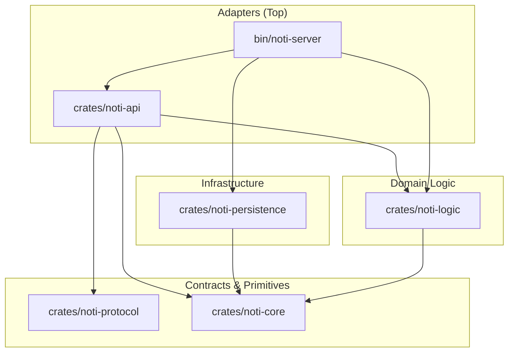

# Notification Service (`gridtokenx-noti-service`)

The **Notification Service** handles all outbound communications for the GridTokenX platform. It functions as a centralized, stateful notification dispatcher supporting multiple delivery channels (Email, WebSockets, SMS, Push notifications, and Webhooks) with built-in HTML templating, rate-limiting, idempotency verification, and robust retry logic.

---

## 🏗️ Architecture

The service is structured as a **Modular Monolith** Cargo workspace (Edition 2024, 6 crates) following the **"Sync Core, Async Edges"** design pattern with **hexagonal (ports-and-adapters)** architecture. It enforces strict acyclic layering where dependencies flow downwards.

For the full architecture reference, see [ARCHITECTURE.md](ARCHITECTURE.md).

```
gridtokenx-noti-service/
├── bin/
│   └── noti-server/           # Application entry point, startup wiring, background consumers
├── crates/
│   ├── noti-core/             # Domain models, config, 6 DI traits, NotiError (thiserror)
│   ├── noti-protocol/         # ConnectRPC/gRPC wire contracts from proto/noti.proto
│   ├── noti-persistence/      # SQLx Postgres (dual-pool), Redis, RabbitMQ, Kafka, SMTP, Tera, providers
│   ├── noti-logic/            # NotificationOrchestrator — sync business rules (queue, dispatch, retry)
│   └── noti-api/              # Axum REST, ConnectRPC, JWT auth, WebSocket registry
├── migrations/                # SQLx database schema migrations
├── proto/                     # Protobuf service definition
└── templates/                 # Tera email (HTML + plain text) and WebSocket templates
```

### Dependency Flow



---

## 🚀 Key Features

* **Multi-Channel Dispatcher:** Native handlers for **Email** (SMTP/Lettre with multipart HTML+text), **WebSockets** (real-time push), **Webhooks** (reqwest HTTP POST), and **Push** (FCM HTTP v1 — mobile Android/iOS + web). Mock provider for **SMS**.
* **FCM Push (mobile + web):** `FcmProvider` delivers via Firebase Cloud Messaging HTTP v1. Self-mints OAuth2 from a service-account JSON (no Google-auth dependency), fans one notification out to all of a user's registered device tokens, and self-heals — dead tokens (`UNREGISTERED`/`INVALID_ARGUMENT`/HTTP 404) are auto-revoked. Falls back to `MockPushProvider` until `FCM_PROJECT_ID` + `FCM_CREDENTIALS_PATH` are both set.
* **SSRF-Hardened Webhooks:** Webhook delivery enforces http/https only, disables redirects, and pins the connection to a vetted public-unicast IP (blocks loopback/RFC1918/link-local/CGNAT/ULA + v4-mapped) to defeat DNS rebinding. `with_block_private(false)` escape hatch for trusted internal targets.
* **HTML Email Templates:** Styled HTML templates with green/amber gradient design for welcome, verification, password reset, and ERC issuance emails. Automatic multipart generation (HTML + plain text fallback).
* **Template Engine:** Dynamically renders email and alert bodies using [Tera](https://tera.netlify.app/) (Jinja2-like templates) with HTML autoescaping.
* **Robust Retry Strategy:** RabbitMQ Dead-Letter Exchange (DLX) with message TTL for exponential backoff (2^n × 60s, max 5 retries) without blocking worker threads. RabbitMQ is **required** — the durable retry queue is mandatory, so startup fails fast on an empty `RABBITMQ_URL`.
* **Crash Recovery:** Boot-time sweep resets rows stuck in `Processing` back to `Pending`, then re-dispatches all currently-due `Pending` rows — no notifications lost across restarts.
* **Event-Driven Intake:** Background Kafka consumer listens to platform events (`UserRegistered`, `OrderMatched`, `SettlementProcessed`, `ErcIssued`, `VppDispatched`, `PasswordResetRequested`, `VerificationEmailRequested`, `UserOnboarded`, `MeterOnboarded`, `UserWalletLinked`) to trigger automatic notifications.
* **URL Rewriting:** Email callback links are automatically rewritten from internal addresses (`localhost:4001`) to the configured frontend URL, preserving path and query parameters.
* **Real-time Push (WebSockets):** Decoupled `ConnectionManager` (DashMap-based) with JWT-authenticated WebSocket sessions.
* **Dual PostgreSQL Pools:** Separate high-priority (writes) and low-priority (reads) connection pools for query routing.
* **HTTP/3 & QUIC Support:** Concurrent HTTP/3 server over UDP alongside TCP ConnectRPC on the gRPC port.
* **Idempotency & Caching:** Redis for idempotency checks, distributed locks, and rate-limiting.

---

## 🔌 API Reference

### REST Endpoints

The HTTP API serves on `PORT` (default: `8080`). All `/api/v1/` endpoints require `x-gridtokenx-user-id` header.

| Endpoint | Method | Auth | Description |
|:---|:---|:---|:---|
| `/health` | `GET` | None | Service health status |
| `/health/live` | `GET` | None | Service liveness probe |
| `/swagger-ui` | `GET` | None | Swagger UI (interactive OpenAPI docs) |
| `/api-docs/openapi.json` | `GET` | None | Raw OpenAPI 3.1 spec |
| `/api/v1/noti` | `GET` | Header | List notification history (params: `limit`, `offset`) |
| `/api/v1/noti/{id}` | `PATCH` | Header | Mark a specific notification as read |
| `/api/v1/noti/read-all` | `POST` | Header | Mark all user notifications as read |
| `/api/v1/noti/devices` | `GET` | Header | List the user's active push device tokens |
| `/api/v1/noti/devices` | `POST` | Header | Register/reactivate a device token (`{token, platform}`; platform ∈ `android`,`ios`,`web`) |
| `/api/v1/noti/devices/{token}` | `DELETE` | Header | Revoke a device token (logout/unregister) |
| `/ws?token=<jwt>` | `GET` | JWT | Initiate a WebSocket session for real-time push |

### gRPC / ConnectRPC Service

Exposed on `PORT + 10` (default: `8090`):

* `SendNotification`: Queue and trigger notifications (channel, recipient, template, variables, idempotency key).
* `GetNotificationStatus`: Look up delivery status of a notification by ID.

---

## ⚙️ Configuration

The service loads settings from environment variables or YAML configuration files in `config/` via the `config` crate.

| Variable | Default | Purpose |
|:---|:---|:---|
| `PORT` | `8080` | HTTP REST port. gRPC = `PORT + 10` |
| `DATABASE_URL` | *Required* | PostgreSQL connection string |
| `REDIS_URL` | *Required* | Redis connection string (cache, idempotency, locks) |
| `KAFKA_BROKERS` | *Optional* | Comma-separated Kafka brokers. If empty → no Kafka consumer |
| `KAFKA_TOPIC_USER_EVENTS` | `iam.user.events` | Kafka topic for user events |
| `KAFKA_TOPIC_AUDIT_EVENTS` | `iam.audit.events` | Kafka topic for audit events |
| `RABBITMQ_URL` | *Required* | RabbitMQ connection string. Durable retry queue is mandatory — startup fails if empty |
| `JWT_SECRET` | *Required* | JWT secret for WebSocket authentication |
| `SMTP_HOST` | *Optional* | SMTP server host. If empty → mock email provider |
| `SMTP_PORT` | `587` | SMTP port |
| `SMTP_USER` | *Optional* | SMTP username |
| `SMTP_PASS` | *Optional* | SMTP password |
| `SMTP_FROM` | `no-reply@gridtokenx.com` | Sender email address |
| `SMTP_TLS_MODE` | `starttls` | `starttls`, `tls` (implicit, port 465), or `none` (Mailpit) |
| `FCM_PROJECT_ID` | *Optional* | Firebase project id. Real FCM push needs this **and** `FCM_CREDENTIALS_PATH` |
| `FCM_CREDENTIALS_PATH` | *Optional* | Google service-account JSON path (mints OAuth2). Both unset → `MockPushProvider` |
| `FRONTEND_URL` | *Optional* | Base URL for email callback links (e.g. `https://trading-ui.example.com/`) |
| `CERT_FILE` | `infra/certs/server.crt` | TLS certificate for HTTP/3 QUIC |
| `KEY_FILE` | `infra/certs/server.key` | TLS private key for HTTP/3 QUIC |

---

## 🛠️ Development

### Build and Test

```bash
cargo build                              # Build entire workspace
cargo check                              # Fast compile check
cargo test                               # Run all tests
cargo test -p noti-logic                 # Test a single crate
cargo clippy -- -D warnings              # Lint (workspace: deny unsafe/unwrap, warn pedantic)
```

### Running Locally

```bash
cargo run --package noti-server
```

### Database Migrations

```bash
sqlx migrate run --database-url "$DATABASE_URL"
sqlx migrate add <name>
```

> Migrations are also **embedded into the binary** (`sqlx::migrate!`) and run
> automatically on startup — the container does not ship the `migrations/` dir.

### Docker

Multi-stage build. The build **context is the superproject root**
(`gridtokenx-coresystem/`) because `noti-server` has path dependencies on the
sibling crates `gridtokenx-blockchain-core` and `gridtokenx-telemetry`:

```bash
# from gridtokenx-coresystem/ (the superproject root)
DOCKER_BUILDKIT=1 docker build \
  -f gridtokenx-noti-service/Dockerfile \
  -t gridtokenx-noti-service:latest .
```

- **No build cache in the image.** The cargo registry/git caches and `target/`
  live only in BuildKit cache mounts, never in an image layer. The final image
  carries just the stripped binary, the runtime `templates/`, and the shared
  libs the binary links (`libssl3` via the Solana SDK; CA certs for TLS).
- Runs as non-root on `debian:bookworm-slim`. Exposes `8080` (HTTP) + `8090`
  (gRPC).

```bash
docker run --rm -p 8080:8080 -p 8090:8090 --env-file .env \
  gridtokenx-noti-service:latest
```

---

## 📄 Event Types

| Event | Channel | Template | Description |
|:---|:---|:---|:---|
| `UserRegistered` | Email | `welcome.html.tera` | Welcome email with feature list |
| `OrderMatched` | WebSocket + Push | `trade_matched.txt.tera`, `push_notification.txt.tera` | Trade match alert to buyer and seller — WebSocket (live) + FCM push (mobile/web) |
| `SettlementProcessed` | WebSocket + Push | `settlement_processed.txt.tera`, `push_notification.txt.tera` | Settlement status to buyer and seller (when party UUIDs present) |
| `ErcIssued` | Email | `erc_issued.html.tera` | Renewable Energy Certificate issuance |
| `VppDispatched` | WebSocket | `vpp_dispatched.txt.tera` | Virtual Power Plant dispatch alert |
| `PasswordResetRequested` | Email | `password_reset.html.tera` | Password reset link with URL rewriting |
| `VerificationEmailRequested` | Email | `verify_email.html.tera` | Email verification with URL rewriting |
| `UserOnboarded` | WebSocket | `user_onboarded.txt.tera` | On-chain account creation confirmation |
| `MeterOnboarded` | WebSocket | `meter_onboarded.txt.tera` | Smart meter registration confirmation |
| `PriceAlertTriggered` | WebSocket + Push | `price_alert_triggered.txt.tera`, `push_notification.txt.tera` | Price-alert firing to the alert owner |
| `UserWalletLinked` | WebSocket + Push | `security_alert.txt.tera`, `push_notification.txt.tera` | Security alert for wallet linking (push so owner sees it off-session) |
